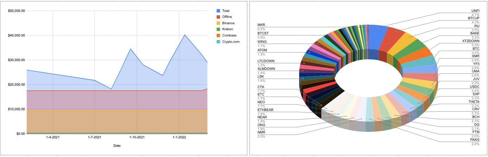
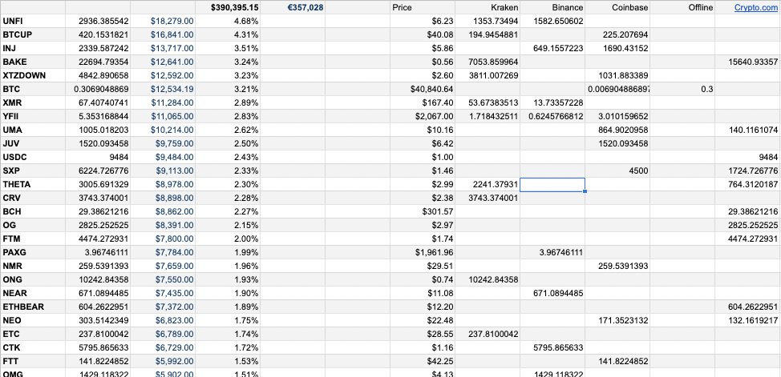
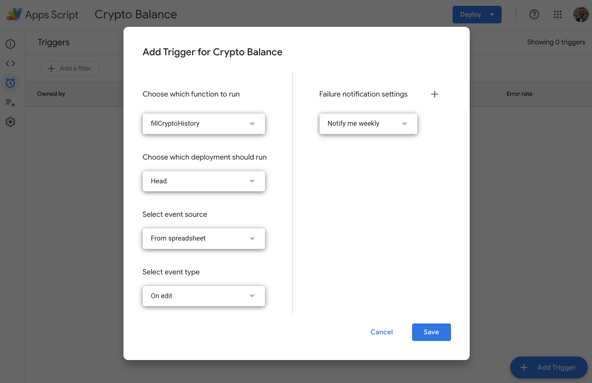
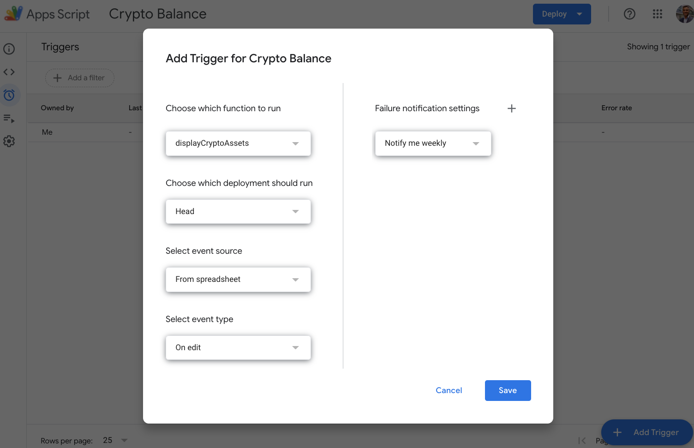

# Crypto Portfolio

Cryptocurrency portfolio Google sheet to collect and analyze cryptocurrency data and generate reports from your accounts on several crypto exchanges.

# Features:
- [x] Collect cryptocurrency data from multiple exchanges.
- [x] Generate reports from your accounts.
- [x] Generate graphs from your portfolio.
- [x] Cache data to reduce API calls.
- [x] Gather coin prices from multiple exchanges.

# Supported exchanges:
 - [Binance](https://accounts.binance.com/en/register?ref=114054479)
 - [Coinbase](https://www.coinbase.com/join/gadelk_p)
 - [Crypto.com](https://crypto.com/exch/8e8ju9mark)
 - [Kraken](https://www.kraken.com/sign-up)
 

Coin price data is collected from CoinMarketCap and CoinGecko in addition to the exchanges above.

# Installation:
- Open ready template [https://docs.google.com/spreadsheets/d/1Xt03dgaP-d1wFatrncyyR6mOnwE_oFHZpaQQRjpw-_s/edit?usp=sharing](https://docs.google.com/spreadsheets/d/1Xt03dgaP-d1wFatrncyyR6mOnwE_oFHZpaQQRjpw-_s/edit?usp=sharing)
- Open File > Make a copy to be able to edit the document. 
- Open Extensions >  Apps Script.
- Press 'Run' from top menu and give permissions to the Crypto Portfolio project. (more info : [https://spreadsheet.dev/authorizing-an-apps-script](https://spreadsheet.dev/authorizing-an-apps-script))
- Add your API keys to the Keys sheet and leave out the ones you do not need.
- Clear the 'Crypto: History' sheet from test data, so it tracks your own portfolio history.
- Clear the 'Crypto: offlline' sheet from test data and add any offline wallets balances you have.
- Clear the 'Crypto: Binance Locked' sheet from test data and add any Binance locked coins you have. (more info: [https://dev.binance.vision/t/earn-locked-staking/1453](https://dev.binance.vision/t/earn-locked-staking/1453))
- Add these two 'on edit' triggers to Apps Script:

- The Crypto sheet should now update on every edit.
- To switch back to the test data, add 'test' to the binance API Key cell.
- Sign up on the exchanges using our referral link:
    - [https://accounts.binance.com/en/register?ref=114054479](https://accounts.binance.com/en/register?ref=114054479)
    - [https://www.coinbase.com/join/gadelk_p](https://www.coinbase.com/join/gadelk_p)
    - [https://crypto.com/exch/8e8ju9mark](https://crypto.com/exch/8e8ju9mark)
    - [https://www.kraken.com/sign-up](https://www.kraken.com/sign-up)
    - [https://pro.coinmarketcap.com/signup/](https://pro.coinmarketcap.com/signup/)
